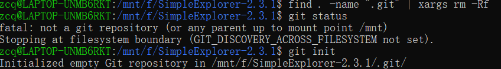
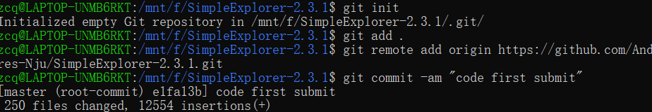
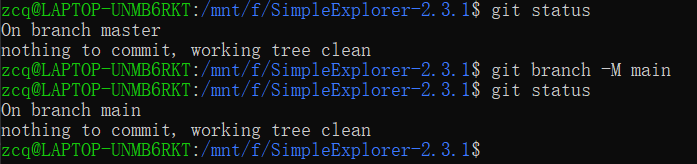
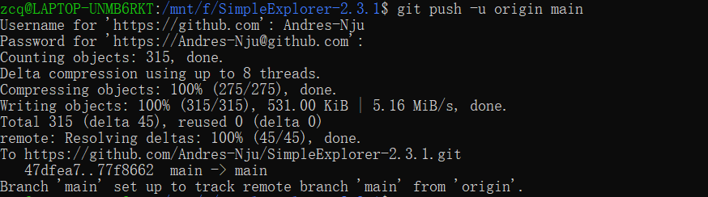

# 南京大学计算机科学与技术系

## 软件工程实验报告

**实验名称：项目协同开发管理与工具集成环境实验**                

**学  号：191220152**                 

**姓  名：张城铨**                 

**指导教师：张天**                 

**实验地点：基础实验楼乙208**                 

**实验时间：2021.11.18**  

### 一. 实验名称

**项目协同开发管理与工具集成环境实验**

### 二. 实验目的

- 了解协同开发与持续集成过程。

- 学会使用项目协同开发管理工具 `git/github`

- 了解持续集成并使用`jenkins`自动构建项目。

### 三. 实验环境

- 软件： `APP: SimpleExplorer-2.3.1`

- 硬件： `Android`版本：`Android 11.0 `

​			         虚拟机：`Pixel 2 API 30`

### 四、实验内容

- 安装 `git`，在本地将你的开源项目目录初始化为 git 仓库 (如已有`.git` 文件夹请先删除)

  - 

    首先在开源项目目录下清除之前已有的`git`仓库

  - 

    然后`git init`创建新的本地仓库，并连接到远程仓库，`git add .`将目录下所有文件加入本地仓库

    再`git commit`刚才`add`进来的文件并打上备注`code first submit`

  - 

    创建远程仓库后官网指导中有一个`git branch -M main`的操作修改了当前`master`分支的名字为`main`（网上查了之后推测大概是`master`涉及黑人敏感词？）
    
  - 先`push`初始代码上去

    

- 在本地尝试修改、提交、回退等过程，在报告中展示你的操作，并使用 `git diff`, `git log`, `git status` 等命令展示操作前后的区别

  - 

- 根据实验三针对几个页面进行微调的任务，在本地为每个子任务创建一个分支并在各 分支上进行开发，最终将所有修改合并到 master 分支上；如有冲突请尝试解决。在报 告中展示你的操作，并使用 git log --graph 命令展示分支合并图 

- 给你的某个稳定版本的代码打上标签

- 注册 `github` 账号，在账号中创建远程仓库 (权限请设置为 `public`)；把本地的所有分支和标签推送到远端 

-  使用 `pull request` 提交自己的代码和报告 (作业提交说明里细 ) 

### 五、在报告中回答以下问题：

使用 `git` 的好处？

 使用远程仓库 (如 `github/gitee` 等) 的好处？

在开发中使用分支的好处？你在实际开发中有哪些体会和经验？

如果你额外学习并实践了关于` git/github` 的其他进阶操作 (如 `merge `和 `rebase `的区 别、`reset` 和 `revert` 的区别、`stash`, `cherry-pick` 的使用等)，可在报告中展示

